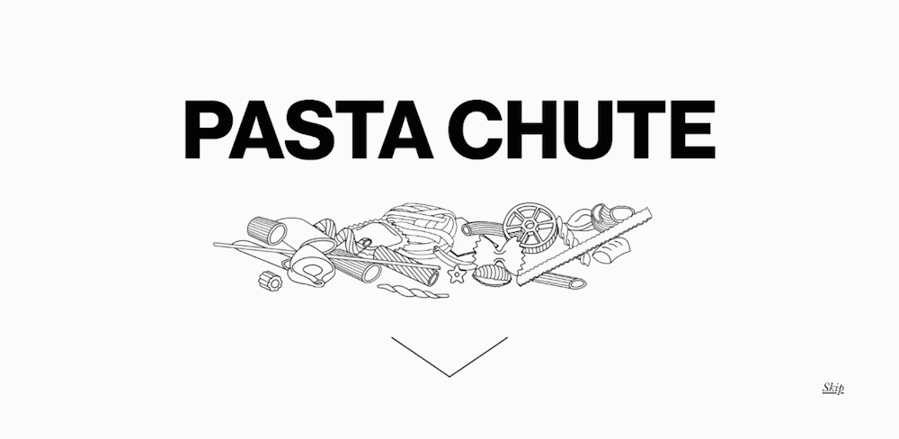
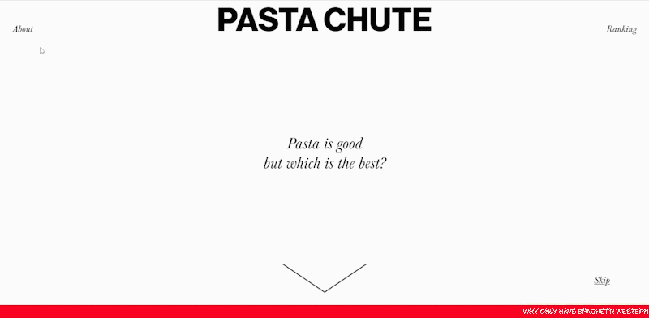
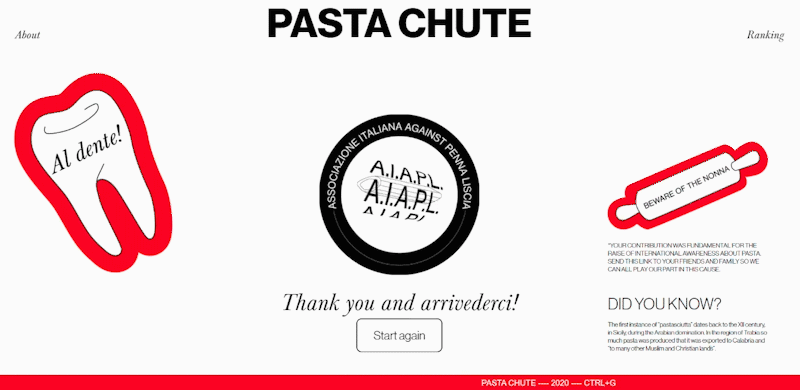

## About
"Pasta Chute" is a virtual common space built on [p5.js](https://p5js.org) that aims to connect people thanks to a topic of general interest: pasta.
The app is playable at: https://pastachute.herokuapp.com/<br>
"Past Chute" was developed as a part of the [Creative Coding](https://drawwithcode.github.io/) course at Politecnico di Milano.<br>
<br>Faculty: Michele Mauri, Tommaso Elli, Andrea Benedetti

## Table of Contents
1. [Project idea](#Project-idea)<br>
a. [Concept](#concept)<br>
b. [Context of use](#context-of-use)<br>
2. [Structure](#structure)<br>
a. [Homepage](#homepage)<br>
b. [Poll](#poll)<br>
c. [Waiting room](#waiting-room)<br>
d. [About](#about)<br>
e. [Ranking](#ranking)<br>
f. [Thank you page](#thank-you-page)<br>
3. [The Code](#the-code)<br>
a. [Design challenges](#design-challenges)<br>
b. [Coding challenges](#coding-challenges)<br>
c. [Tools](#tools)<br>
4. [Team](#team)<br>

## Project idea
#### Concept
As harmless as it might look, pasta often ends up at the center of animated debates, especially in our country.<br>
Our team wanted to trigger the same heartfelt involvement in this kind of debate, by asking users to root for their favorite type of pasta.<br>
The purpose is light and humorous: to entertain people through a very simple, yet engaging experience and to make them feel part of something big, despite (or maybe even thanks to) the trivial subject.
The creative process is very similar to the one of memes, as it starts from picking a very simple piece of culture that has a surprisingly big impact because of its universality.


#### Context of use
The project is addressed to a broad target audience, but it's expected to spark interest mostly among young people.<br>
The game is always ongoing and there are no special events, so that people can jump in, fool around and browse the app whenever they want. This is why it was very important for us to make the game suitable for both computers and mobile devices.<br>
Friends can arrange to visit the website at the same time to play together or against each other, but one can also play alone, fooling around, asking themselves what pasta they prefer, discovering new types and formats, learning new information about pasta, and browsing the game records.


## Structure
#### Homepage
The homepage is designed to welcome the user and to prepare them to the fast dynamics of the poll. The library [skrollr](https://github.com/Prinzhorn/skrollr) was used to display a sequence of very concise information about the attitude they need to take on: be fierce, be fast and ready to click.<br>
Once they are ready to enter the game, the user clicks on a button and a pop-up appears that counts down the time remaining to the end of the current match (max. 15 seconds).<br>
The purpose of this section is to entertain the user until the start of a new match, so that they don't find themselves in the middle of a duel that has already started. It contains a mini-game: pieces of pasta falling from above and a colander that can be moved to catch as many pieces as possible.



#### Poll
The poll works in a very simple way. The screen is split in two halves; each side houses each round a different type of pasta. The user needs to place their mouse (or their finger) on the side they want to vote for, and click (or tap) as many times as possible to make it win. Each click generates a piece of the chosen pasta in that position of the screen, this then falls on the ground and piling up on the others, thanks to the mechanics of [matter.js](https://brm.io/matter-js/). This visual representation makes it very easy to understand what pasta is winning and the contribution of the other users, who are generating pasta on the other side of the screen.<br>
Each match last 15 seconds. The short duration makes the single contest very quick and ephemeral, but all results contribute to the overall ranking.


#### Waiting room
The waiting room is a 5-second-long transitional phase between a match and another.<br>
A truly Italian-stereotype-style red checkered tablecloth flutters on the screen and falls at the end of the timer, uncovering the actual poll. During this phase, online users can see each other's cursors, in the form of forks, and therefore understand how many players are online with them at that moment.<br>
If one is tired to play, there is a button that leads to the ["Thank you" page](#thank-you-page).<br>
The tablecloth is a 3D object built in [three.js](https://threejs.org/), which was taken from [Memetic Warfare Archive](https://densitydesign.github.io/teaching-dd15/course-results/es03/group03/).


#### About
The section "About" is a hidden overlay that slides over the screen from the left, when triggered by clicking (or tapping on) the corresponding button in the header.<br>
It contains information about the project and the elective course. A click on the symbol of the typical Italian hand gesture "mano a borsa" displays the names of the team members and of the professors.



#### Ranking
The section "Ranking" is a hidden overlay that slides over the screen from the right, when triggered by clicking (or tapping on) the corresponding button in the header.<br>
It contains the global results of the game. It ranks all the types of pasta by the total amount of clicks received.


#### Thank you page
This page is reachable through the waiting room, the user can visit it when they are tired of playing and want to leave the website. It contains each time a different piece of trivia about pasta, which is randomly selected from an array.



## The Code
The app was built mostly in [p5.js](https://p5js.org/). The library [matter.js](https://brm.io/matter-js/) was used to render the mechanics of the pieces of pasta falling from above.

#### Design challenges
One of the design challenges was creating a web app that was true to our vision of a simple, brutalist website with a cool graphic setup and a conscious and punctual use of colour.<br>
The core idea was to create a cool engaging web experience regardless of the simplicity of the chosen topic.<br>
From the get-go we had a clear idea of how the app should look like from the typographical point of view: the juxtaposition of a bold grotesk font and an italic serif. The idea was to pair the textual elements with illustrations of the various formats of pasta, drawn in a "wireframe" style.<br>
One of the challenges that came up during the illustration process was making sure they looked in line with the rest of the website, not being too organically realistic - which would clash with the overall look - or geometrically rigid, which would make the pieces look stiff when falling and piling up.<br>
<br>

<br>
<br>
Despite the overall minimalistic style choice, we wanted to include some playful elements like:
* the red news ticker-like red banner. In the homepage it displays some Italian expressions about food, that were literally translated into English, mantaining a questionable syntax. In the page of the poll, it displays the number of users online and the result of the previous match.
* the picture of the typical Italian "mano a busta", in the "About" section, that rotates and mimics the hand gesture on hover, and displays the names of the team members and of the professors on click.
* the textual and graphic elements in the "Thank you" page.

From the perspective of HTML and CSS design, it wasn't easy to fit all of the information in as few HTML documents as possible. This required the generation and management of several hidden overlays.<br>
It also wasn't easy to make the website responsive for viewing and interacting on mobile, considering the different interaction methods between the two types of devices and the change in proportions and screen ratios. This required the generation of many different stylesheets.

[mobile](links/mobile.gif)
#### Coding challenges

Coding-wise one of the challenges was linked to the usage of the timer function and all the other functions linked to it. A variable needed to be passed from a webpage to another, and certain functions needed to be called when the timer reached a certain amount, like the calling of the curtain function, when a match ends and it consequent fall and deletion. We solved this specific issue by deleting the curtain scene and then re-creating it at the end of each round!<br>

Another coding issues we ran into, was linked to the pixel density of mobile screens. When the game was displayed vertically on a smartphone, p5 interpreted the canvas as made up by a very large amount of pixels vertically, and therefore the pieces of pasta looked like they were falling in slow-motion. We solved this issue by creating an if-statement that handled the physics of the pieces of pasta according to the proportions and the ratio of the screen.


One of the first challenges we had to face in order to make a timer based match game,
was to make a universal time agreed by every user so that every player in the game was
synched to the same phase of the game; To achieve this we used the setInterval function
in the server to update and then reset a timer, that would be sent to every user to sync
them in the same phase.

```
  function phasef(){
    socket.emit("timer", timer); //send timer
    socket.emit("vs",vs1,vs2); //send opponents
    socket.emit("phase"+phase); //send phase
  }

setInterval(function(){
  timer++; //update timer every sec
  if (timer <= 4) {phase = 0; }
  if (timer > 4 && timer <= 19) {phase = 1;}
  if (timer > 19 && timer < 24) {phase = 2;}
  if (timer > 24) {phase = 0; timer = 0; getRandomNumber(); punteggio1 = 0; punteggio2 = 0;} //get a random value for the looser
}, 1000);
```

We needed also a place to store and update the total score of each type of pasta, so we used Firestore Database
We found a lot of challenges optimizing the database read process to avoid overloading it, ;


```
db.collection("Pasta").orderBy('score','desc').onSnapshot(snapshot => {
    let i=0;
    let changes = snapshot.docChanges();
    changes.forEach(change => {

    if(change.type == 'added'){
    // console.log('snapshot')
    namerank = document.getElementById('pasta-td-'+i);
    namerank.innerHTML=change.doc.data().name
    scorerank = document.getElementById('score-td-'+i);
    scorerank.innerHTML=change.doc.data().score
          i++
        }
    });
});
```


In the end in order to minimize the number of reading from the database, while also keeping all the data updated in realtime
we ended up using local variables updated by the socket.io server instead of relying on reading them continously from the database.

```
socket.on("mousedx", mouseMessagedx);
socket.on("mousesx", mouseMessagesx);

 function mouseMessagedx() {
  punteggio2++
  socket.broadcast.emit("scoreBroadcast2", punteggio2) //send 2 pasta type
 }

 function mouseMessagesx() {
  punteggio1++
  socket.broadcast.emit("scoreBroadcast1", punteggio1)
 }
```

 At the beginning of each waiting room, to call the creation of the tablecloth in vendor.js we reset the 3d scene when the 'timer' variable in the server was equal to zero


```
   function startTimer() {
     if(timer==0){
       while(p.children.length > 0){
       p.remove(p.children[0]);
       F()}
     }

  function F() {
     if(qgotten){
     0 < q.length ? (q = y[0], document.body.classList.add("dropped")) :
     (E = 10, q = y[1], document.body.classList.remove("dropped"), z = !0, l && (l.visible = !0))
   }
 }
```

#### Tools
* [p5.js](https://p5js.org/)
* [matter.js](https://brm.io/matter-js/)
* [JQuery](https://jquery.com/)
* [skrollr.js](https://github.com/Prinzhorn/skrollr)
* [three.js](https://threejs.org/)

## Team
* [Martina Bracchi](mailto:martinabracchi.mb@gmail.com)  
* [Silvia Casavola](mailto:silcasavola@gmail.com)
* [Dario Faudella](mailto:dario.faudella@gmail.com)  
* [Manuel Reale](mailto:manuel.reale2000@gmail.com)
* [Donato Renzulli](mailto:donren.99@gmail.com)
